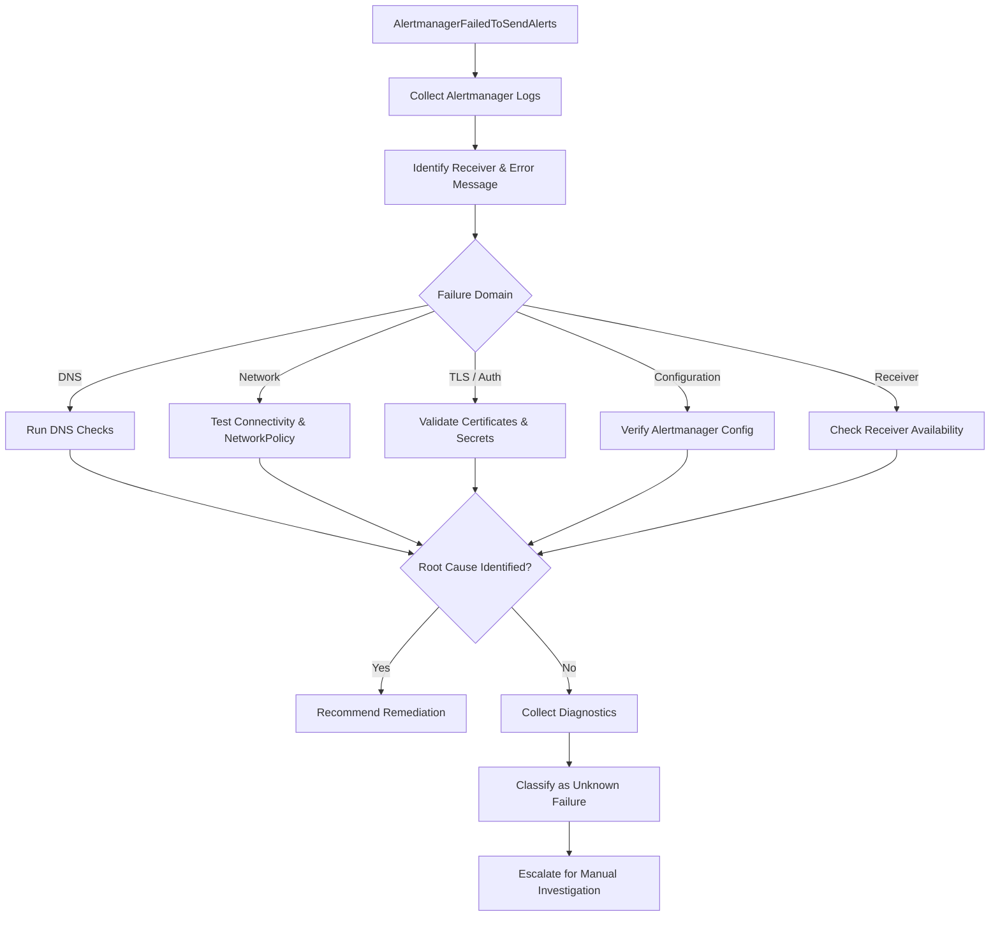

AlertmanagerFailedToSendAlerts

PrometheusRule source: alertmanager-main-rules
Alert severity: Warning
Pending period: for: 15m
OpenShift runbook:
https://github.com/openshift/runbooks/blob/master/alerts/cluster-monitoring-operator/AlertmanagerFailedToSendAlerts.md

Meaning

This alert in OpenShift means that one or more Alertmanager instances in your cluster monitoring stack are repeatedly failing to send notification alerts to an external integration receiver.

When this warning fires, it indicates a breakdown in your downstream notification pipeline (e.g., emails, Slack webhooks, PagerDuty, or Webhook URLs).

Impact
The impact depends on the importance of the affected notification receiver (for example, Slack, Webhook, Email, or PagerDuty).
Alert generation is not affected; alerts continue to be evaluated and fired by Prometheus. Alertmanager continues to receive and process alerts, but it is unable to deliver notifications to the affected receiver.
The operations team may not be notified of critical incidents in a timely manner. Incident response may be delayed due to missed or delayed notifications.
Automated diagnosis or remediation workflows that rely on Alertmanager notifications (for example, webhooks to automation platforms) may not be triggered.
Diagnosis

Variables (from alert):

CLUSTER=<labels.cluster>
NS=<labels.namespace>
POD=<labels.pod>

ALERTNAME=<labels.alertname>

| Diagnosis | What to look for | Cause | Action |
|------------|------------------|-------|--------|
| `oc logs -n openshift-monitoring -l app.kubernetes.io/name=alertmanager -c alertmanager --tail=50` | Notification delivery failed with `HTTP 404` (Not Found), indicating an invalid webhook endpoint. | Configured an invalid receiver's API URL | Validate the receiver URL configured in Alertmanager: `oc -n openshift-monitoring get secret alertmanager-main --template='{{ index .data "alertmanager.yaml" }}' \| base64 --decode` |
| `oc logs -n openshift-monitoring -l app.kubernetes.io/name=alertmanager -c alertmanager --tail=50` | Notification delivery failed due to `TLS certificate verification failure (x509: certificate signed by unknown authority)`. | Invalid receiver hostname, certificate expired | Validate the hostname and certificate expiry |
| `oc logs -n openshift-monitoring -l app.kubernetes.io/name=alertmanager -c alertmanager --tail=50` | `context deadline exceeded` | Network Connectivity | Validate network connectivity, proxy configuration or if any change required at firewall level |
| `oc logs -n openshift-monitoring -l app.kubernetes.io/name=alertmanager -c alertmanager --tail=50` | `connection reset by peer` | Connectivity problems with external SMTP server or routing issues between mail load balancer and the backend mail servers | Test network connection from alertmanager pod `curl -kv <smtp_domain_or_ip>:25`, or collect `tcpdump` to further investigate |
| `oc logs -n openshift-monitoring -l app.kubernetes.io/name=alertmanager -c alertmanager --tail=50` | `502 Bad Gateway` \| `503 Service Unavailable` | Receiver health issue | Verify receiver's health. External services require manual follow-up |

## Mitigation

The resolution depends on the particular issue reported in the logs.

## Decision Flow

