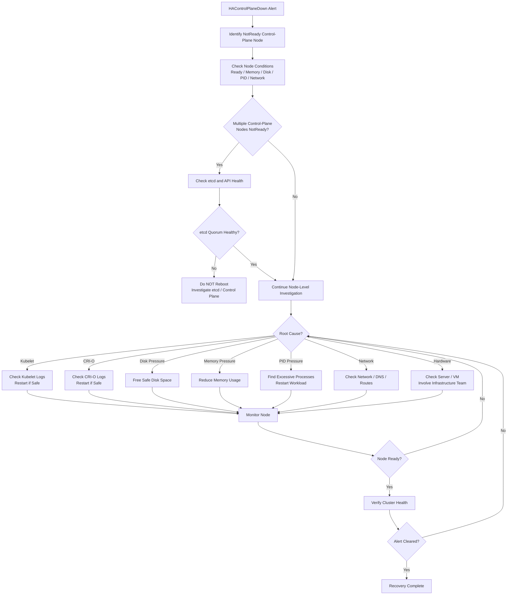

# HAControlPlaneDown

PrometheusRule Source: `kubevirt-cnv-prometheus-rules` · Alert Severity: `Critical` · Pending Period: `5m` · [Runbook](https://github.com/openshift/runbooks/blob/master/alerts/openshift-virtualization-operator/HAControlPlaneDown.md)

---

## Meaning

HAControlPlaneDown fires when a control-plane node has been in a NotReady state for more than 5 minutes.
This indicates that the affected control-plane node is not successfully reporting its health status to the Kubernetes control plane.

***Expression:***

```bash
kube_node_role{role="control-plane"} * on (node) kube_node_status_condition{condition="Ready",status="true"} == 0
```
---

## Impact

A failed control-plane node can reduce control-plane redundancy and may affect:

- Kubernetes API availability
- Scheduler availability
- Controller manager availability
- etcd availability, when etcd is colocated with the control-plane node
- Cluster upgrades and MachineConfig operations
- Ability to schedule or manage workloads
- Overall control-plane high availability

---

## Diagnosis

### Issue-Type-Based Investigation

| Issue Type | Commands | What to Look For | Action |
|---|---|---|---|
|**Identify Node & Overall Impact** | `oc get nodes -l node-role.kubernetes.io/control-plane='' -o wide` | Identify which control-plane node(s) are `NotReady`. | **1 node NotReady:** Continue node-level diagnosis. **Multiple nodes NotReady:** Treat as a broader control-plane/infrastructure issue and check etcd/API immediately. |
| | `oc describe node <node-name>` | Check `Ready`, `MemoryPressure`, `DiskPressure`, `PIDPressure`, `NetworkUnavailable`, and Events. | Use conditions/events to identify the likely issue category. |
| | `oc get node <node-name> -o json \| jq '.status.conditions'` | Identify conditions that are `True`, `False`, or `Unknown`. | Focus on the fields like "message","reason" & "status". |
|**Control Plane / etcd Impact** | `oc get co etcd kube-apiserver kube-controller-manager kube-scheduler` | Check `AVAILABLE`, `PROGRESSING`, and `DEGRADED`. | If etcd/API is degraded, **do not immediately reboot** the affected control-plane node. Investigate control-plane/etcd health first. |
| | `oc get pods -n openshift-etcd -o wide` | etcd pods should be `Running` and `Ready`. Check restarts, `Pending`, or `Terminating`. | If an etcd member is unhealthy, verify etcd quorum before recovering/rebooting the node. **Avoid having two etcd members unhealthy at the same time.** |
|**Resource Issue — CPU / Memory** | `oc adm top node <node-name>` | Check for very high CPU/memory utilization. | Investigate possible resource exhaustion. |
| | `oc get node <node-name> -o json \| jq '.status.conditions[] \| select(.type=="MemoryPressure")'` | Check whether `MemoryPressure=True`. | Investigate memory exhaustion, OOM events, and memory-consuming workloads/processes. |
| **Resource Issue — Disk / Inodes** | `oc get node <node-name> -o json \| jq '.status.conditions[] \| select(.type=="DiskPressure")'` | Check whether `DiskPressure=True`. | If confirmed, investigate filesystem usage and safely free disk space.|
| **PID / Process Exhaustion** | `oc get node <node-name> -o json \| jq '.status.conditions[] \| select(.type=="PIDPressure")'` | Check whether `PIDPressure=True`. | Investigate process/PID exhaustion and identify processes creating excessive numbers of processes/threads. |
| **Kubelet Issue / Service Down** | `systemctl status kubelet` | Check whether kubelet is stopped, failed, or repeatedly restarting. | If kubelet is unhealthy, check its logs before restarting it. |
| | `journalctl -u kubelet --since "30 minutes ago"` | Look for node status/lease, CNI, certificate, CRI-O, disk, OOM, or authentication errors. | Identify the root cause and apply targeted remediation. |
| | `systemctl restart kubelet` | Use **only when kubelet is confirmed as the problem** and the node/cluster is otherwise healthy. | Restart kubelet and monitor node recovery. |
| **CRI-O / Container Runtime Issue** | `systemctl status crio` | Check whether CRI-O is stopped or unhealthy. | Investigate CRI-O before repeatedly restarting kubelet. |
| | `journalctl -u crio --since "30 minutes ago"` | Look for runtime, storage, or container errors. | Address the CRI-O/runtime issue first. |
| **Network Issue** | `ip addr` | Check for missing/down interfaces or unexpected IP configuration. | Investigate node network/interface configuration. |
| | `ip route` | Check for missing or incorrect routes. | Investigate routing/network configuration. |
| | `resolvectl status` | Check DNS configuration. | Investigate DNS/network configuration if resolution is failing. |
| | Test connectivity from node to API endpoint | Determine whether the node can communicate with the API/control plane. | Investigate network, firewall, routing, DNS, or API endpoint connectivity. |
| **Node Down / Infrastructure / Hardware Issue** | Hardware management console | Check whether the node/server is powered on and whether the network interface is connected. | Recover the infrastructure first. Involve the infrastructure/hardware team if required. |
||| Check power state, hardware faults, storage/NIC problems, console output, etc. | If the OS/node itself is unavailable, treat it as an infrastructure/hardware issue rather than a Kubernetes issue. |


---

## Mitigation

Recovery should depend on the identified cause.

***Case A — Kubelet failure***

If the node is otherwise healthy and kubelet is confirmed to be the problem:

```bash
systemctl status kubelet
systemctl restart kubelet
```
Then monitor:
```bash
oc get node <node-name> -w
```
Do not repeatedly restart kubelet without investigating why it stopped.

***Case B — CRI-O failure***

If CRI-O is unhealthy, investigate CRI-O logs first.

If it is safe to restart:
```bash
systemctl restart crio
```
Then check the status:

```bash
systemctl status crio
```
And monitor the node:

```bash
oc get node <node-name> -w
```

***Case C — Disk Pressure***

Perform these steps only if `DiskPressure=True`
If disk pressure is confirmed:

- SSH to the node and run:
```bash
df -h
```
- Check inode usage:
```bash
df -ih
```
- Identify what is consuming space
```bash
du -xhd1 /var 2>/dev/null | sort -h
```

- Check journal usage:
```bash
journalctl --disk-usage
```

- Safely clean up:
Remove only known-safe and unnecessary files such as approved temporary files or old logs.
```bash
journalctl --vacuum-time=7d
```

- Check container storage if applicable:

```bash
du -sh /var/lib/containers/*
```
Do not blindly delete files from /var/lib/containers, /var/lib/kubelet, or other OpenShift-managed directories.

Verify disk space:
```bash
df -h
df -ih
```
Verify DiskPressure:

```bash
oc get node <node-name> -o json | jq '.status.conditions[] | select(.type=="DiskPressure")'
```

Expected:
```bash
DiskPressure: False
```
Avoid blindly deleting files from system directories.

***Case D — Memory Pressure***

Perform these steps if `MemoryPressure=True`

 - Identify memory-consuming workloads
 
 ```bash
 oc adm top node <node-name>
 oc adm top pods -A --sort-by=memory
```

Identify the pods/workloads consuming excessive memory.

- Check for OOM events

 ```bash
oc get events -A --field-selector reason=OOMKilling --sort-by=.lastTimestamp
 ```
 
If you have SSH access to the node:

 ```bash
dmesg | grep -i -E "oom|out of memory"
 ```
 
- Identify memory-consuming processes

```bash
ps aux --sort=-%mem | head -20
```
Determine whether a specific process is consuming abnormal memory.

- Reduce the memory load

If a non-critical workload is responsible, scale it down or restart it according to the application procedure.

For example:
```bash
oc scale deployment <deployment-name> --replicas=<number> -n <namespace>
```
Or:
```bash
oc rollout restart deployment/<deployment-name> -n <namespace>
```

- If the workload legitimately requires more memory

Consider:

Moving workloads to another node.
Increasing the node's memory capacity.
Correcting workload memory requests/limits.
Scaling the application appropriately.

Verify:
```bash
oc get node <node-name> -o json | jq '.status.conditions[] | select(.type=="MemoryPressure")'
```
Expected:
```bash
MemoryPressure: False
```

***Case E — PID Pressure***

Perform these steps if `PIDPressure=True`

- Check PID usage:

```bash
ps -eLf | wc -l
```

- Identify processes creating excessive threads/processes

```bash
ps -eLf | awk '{print $1}' | sort | uniq -c | sort -nr | head
```

- Stop or restart the offending workload

```bash
oc rollout restart deployment/<deployment-name> -n <namespace>
```
If it is a known runaway system process, stop/restart the relevant service according to the approved procedure.

- Identify the offending process/workload
Determine which service, process, or container is creating excessive processes/threads.

- Verify PID pressure

```bash
oc get node <node-name> -o json | jq '.status.conditions[] | select(.type=="PIDPressure")'
```

***Case F — Infrastructure/Hardware failure***

- Use the server's out-of-band management interface such as iDRAC, iLO, IPMI, or the physical console to determine whether the server is powered on and whether there are hardware faults.
- If a hardware failure is identified (for example, disk, memory, NIC, motherboard, or power supply), engage the hardware/infrastructure team for repair or component replacement.
- Once the server is accessible again, verify OS boot, network connectivity, CRI-O, and kubelet.


***Reboot Consideration***

Before rebooting, verify:

- Remaining control-plane nodes are healthy.
- etcd has quorum.
- API server is available.
- There is no ongoing control-plane outage.
- The affected node can safely be restarted.
- Infrastructure team agrees if required.

For a control-plane node, an unplanned reboot can increase risk if another control-plane/etcd member is already unhealthy.

***If the Node Cannot Be Recovered***
This section needs special care in your existing runbook.

You currently have:

oc drain <node-name> --ignore-daemonsets --delete-emptydir-data

I would not present this as a generic recovery action for a failed control-plane node.

For control-plane nodes, first determine:

- whether the node hosts etcd
- whether etcd quorum is healthy
- whether the node is expected to return
- whether the node needs replacement
- whether your OpenShift version/environment has a specific control-plane replacement procedure

For an unrecoverable control-plane node, follow the supported OpenShift control-plane replacement/recovery procedure rather than treating it like an ordinary worker node.

## Recovery Verification

Do not stop after the node changes back to Ready.

Verify Node:

```bash
oc get nodes
```

Expected:
```bash
control-plane-0   Ready
control-plane-1   Ready
control-plane-2   Ready
```

Cluster Operators:
```bash
oc get clusteroperators
```

Confirm that operators are in healthy condition.

Verify etcd :
```bash
oc get pods -n openshift-etcd -o wide
```
Confirm all expected etcd members are healthy.

Verify API :
```bash
oc get --raw='/readyz?verbose'
```

Recent events : 
```bash
oc get events -A --sort-by='.lastTimestamp' | tail -50
```

***Alert Resolution***

Confirm that cluster is healthy by performing below checks:

```bash
oc get nodes -o wide
oc describe node <node-name>
oc get clusteroperators
oc get pods -n openshift-etcd -o wide
oc get events -A --sort-by='.lastTimestamp'
```

## Decision Flow:


