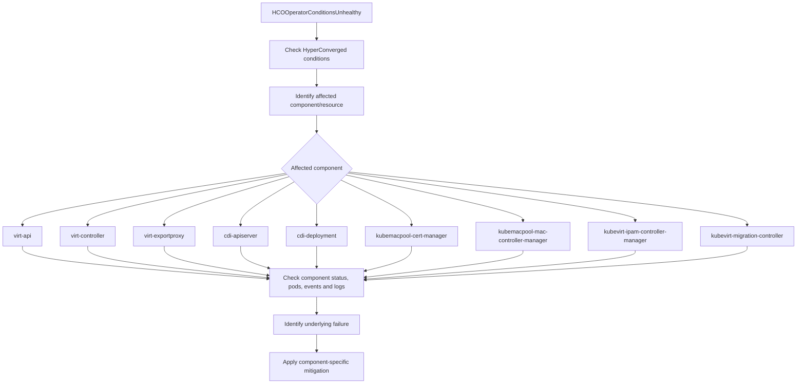

# HCOOperatorConditionsUnhealthy

PrometheusRule Source: `kubevirt-hyperconverged-prometheus-rule` · Alert Severity: `Critical` · Pending Period: `10m` · [Runbook](https://github.com/openshift/runbooks/blob/master/alerts/openshift-virtualization-operator/HCOOperatorConditionsUnhealthy.md)

---

## Meaning

The HyperConverged Cluster Operator (HCO) monitors the health of OpenShift Virtualization and its managed components. This alert fires when HCO reports the virtualization stack as degraded or unhealthy, indicating that one or more critical components required for VM management, networking, migration, or storage are not in a healthy state.

Affected components may include virt-api, virt-controller, virt-exportproxy, kubemacpool-cert-manager, kubevirt-migration-controller, and CDI components.

Expression:

```bash
kubevirt_hco_system_health_status == 2
```
It indicates that HCO has detected an unhealthy/degraded virtualization stack.

---

## Impact

If HCO reports the OpenShift Virtualization stack as unhealthy or degraded:

- Virtual machine operations may be affected, including VM creation, start/stop, deletion, or management.
- VM networking or console access may be impacted if a related virtualization component is unhealthy.
- VM migration and storage operations may be affected when the unhealthy component is responsible for those functions.
- Existing running VMs may continue to operate, depending on which component is affected and whether the issue impacts the VM runtime path.
- The alert indicates a potential degradation of the virtualization platform, but the actual impact depends on the specific component and condition reported by HCO.


## Diagnosis


1. Check HCO status & conditions to see which component is affected :

```bash
oc get hyperconverged kubevirt-hyperconverged -n openshift-cnv \
  -o jsonpath='{range .status.conditions[*]}{.type}{"\t"}{.status}{"\t"}{.reason}{"\t"}{.message}{"\n"}{end}'
```

2. Check events for the affected component

```bash
oc -n openshift-cnv get events --sort-by='.lastTimestamp' | tail -30
```

3. Identify the affected component from HCO status & events, once the HCO message identifies a component, check that affected component/pods specifically.

```bash
oc -n openshift-cnv get pods -o wide 
```

## Mitigation

HCO is normally reporting a problem in one of the components it manages, so remediation should target the component identified during diagnosis.

| Finding during diagnosis | Mitigation action | Verification |
|---|---|---|
| HCO condition identifies a specific component as unhealthy | Investigate and remediate the identified component rather than restarting HCO | HCO condition returns to healthy state |
| Component pod is not running or is repeatedly restarting | Check pod events and logs; resolve the underlying scheduling, configuration, image, or runtime issue | Pod becomes Ready and remains stable |
| Component readiness/liveness probe is failing | Investigate the probe failure and resolve the underlying service/process issue | Pod becomes Ready and probe failures stop |
| Component deployment has unavailable replicas | Investigate unavailable pods and restore the required replicas | Deployment shows the expected number of Available replicas |
| Component has a configuration error | Correct the configuration using the supported OpenShift Virtualization/HCO configuration mechanism | Component becomes Ready and HCO reports healthy |
| Component is temporarily stuck or its process is unresponsive | Restart/recreate only the affected component when safe to do so | Component becomes Ready and HCO health returns to normal |
| Node or scheduling issue affects the component | Resolve the node capacity, scheduling, taint, or node-health issue | Component pod is successfully scheduled and Ready |
| CDI/storage component is unhealthy | Investigate the affected CDI/storage resource and remediate the underlying storage condition | CDI/storage component becomes healthy |
| Migration-related component is unhealthy | Check the affected migration controller/component and active migration resources; remediate the underlying issue | Migration component becomes healthy |
| HCO becomes unhealthy again after remediation | Investigate recurrence using HCO conditions, component events, and operator logs before applying further remediation | HCO remains healthy without recurrence |


## Decision Flow


