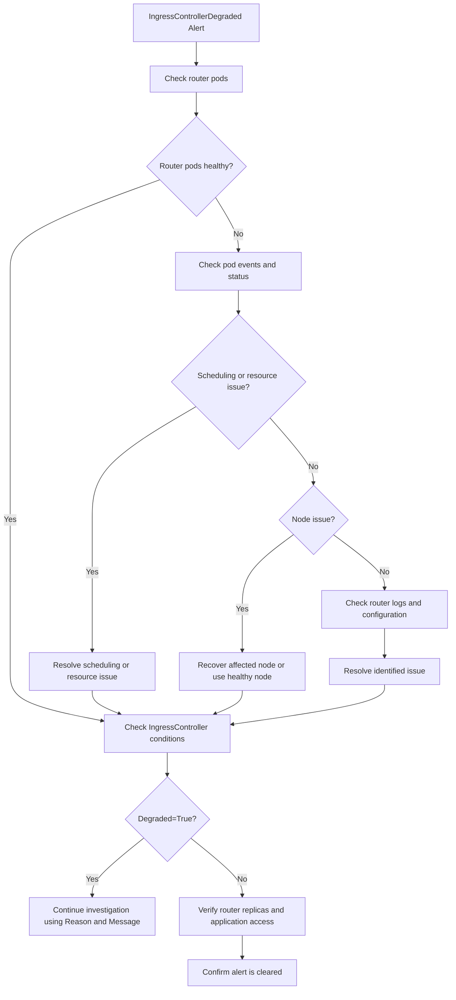

# IngressControllerDegraded

PrometheusRule Source: `ingress-operator` · Alert Severity: `Warning` · Pending Period: `5m` 

---

## Meaning

One or more router pods are unavailable or unable to provide the expected ingress service, causing the IngressController to become degraded

***Expression*** 

```bash
ingress_controller_conditions{condition="Degraded"} == 1
```
---

## Impact

- Applications exposed through the affected IngressController may experience partial or complete service disruption.
- The OpenShift Web Console may become inaccessible if the default ingress routers are unavailable.
- Failed ingress canary checks or insufficient router replicas may affect cluster upgrade readiness.
- The actual impact depends on the number of healthy router replicas and the underlying failure condition.

---

## Diagnosis

| What to look for | Command | Action |
|---|---|---|
| Check the status of router pods | `oc get pods -n openshift-ingress -o wide` | Check for `Pending`, `CrashLoopBackOff`, `Error`, or fewer Running replicas than expected. |
| Check why any router pod is not running | `oc describe pod <router-pod> -n openshift-ingress` | Review **Events** for scheduling failures, resource issues, node problems, or other errors. |
| Check router Deployment status | `oc get deployment router-default -n openshift-ingress` | Compare **DESIRED**, **CURRENT**, **READY**, and **AVAILABLE** replicas. If available replicas are lower than expected, investigate the affected pods. |
| Check IngressController conditions | `oc get ingresscontroller default -n openshift-ingress-operator -o jsonpath='{range .status.conditions[*]}{.type}{"="}{.status}{" \| "}{.reason}{" \| "}{.message}{"\n"}{end}'` | Look for `Degraded=True` and review the reason to identify the cause. |
| Check the nodes hosting router pods | `oc get pods -n openshift-ingress -o wide` | Identify the nodes running the router pods and check whether those nodes have issues. |
| Check node health | `oc get nodes` | Look for nodes in `NotReady` or other unhealthy states. Investigate affected nodes. |
| Check for scheduling/resource problems | `oc describe node <node-name>` | Review **Conditions**, **Taints**, and **Allocated resources**. Address resource or scheduling constraints if they prevent router pods from running. |
| Check router pod logs | `oc logs <router-pod> -n openshift-ingress --tail=100` | Look for errors related to router startup, configuration, certificates, networking, or HAProxy. |


---

## Mitigation


- Resolve the underlying router pod issue identified during diagnosis, such as scheduling, resource, node, or configuration problems.
- Recover unavailable router pods and ensure the expected number of router replicas are Running and Ready.
- If a node issue is identified, restore the node to a healthy state or allow the router pod to run on another suitable node.
- If the issue is configuration or certificate related, correct the reported configuration/certificate problem and verify the router pods recover.
- Verify recovery by confirming the IngressController reports Degraded=False and the expected router replicas are available.

---

## Verification

1. Verify all router pods are Running and Ready:

```bash
oc get pods -n openshift-ingress -o wide
```

2. Verify the router Deployment has the expected available replicas:

```bash
oc get deployment router-default -n openshift-ingress
```

3. Verify the IngressController is no longer degraded:

```bash
oc get ingresscontroller default \
  -n openshift-ingress-operator \
  -o jsonpath='{range .status.conditions[*]}{.type}{"="}{.status}{" | "}{.reason}{" | "}{.message}{"\n"}{end}'
```
Confirm Degraded=False.

4. Verify the alert has cleared from Prometheus/Alertmanager.
5. Verify that applications exposed through the affected IngressController are accessible and responding normally.

---

## Related Alerts:

PodDisruptionBudgetLimit
ClusterOperatorDown
IngressControllerUnavailable
ClusterOperatorDegraded

## Decision Flow

