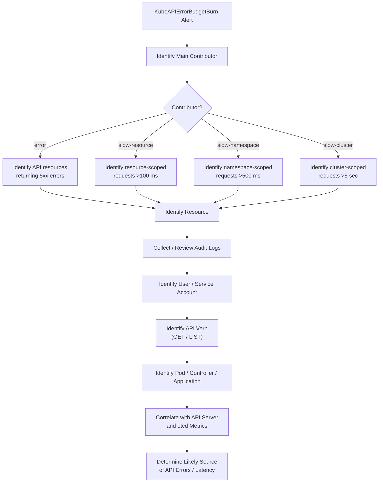

# KubeAPIErrorBudgetBurn

**PrometheusRule Source:** `kube-apiserver-slos-basic` · **Pending For:** `2m,15m,1h,3h` · **Severity:** `Warning/Critical` · [Runbook](https://github.com/openshift/runbooks/blob/master/alerts/cluster-kube-apiserver-operator/KubeAPIErrorBudgetBurn.md)

---

## Meaning

This alert indicates that the Kubernetes API server is experiencing a high number of failed API requests (HTTP 5xx errors) or requests are taking longer than expected to complete.

If this condition continues, the cluster may become unstable because components such as operators, controllers, nodes, and user applications rely on the API server to communicate with the cluster.

This alert includes **four alert rules** for the same API server performance issue:
- **2 Critical alerts**
- **2 Warning alerts**

All four alerts monitor excessive API request failures (HTTP 5xx errors) and high request latency. The difference between them is the **calculation window** used to evaluate the API error budget burn rate. Alerts with shorter evaluation windows detect severe problems sooner, while alerts with longer windows detect sustained performance degradation. The alert severity indicates how quickly the API server is consuming its 30-day error budget and, therefore, how urgently the issue should be investigated.

The alert uses two time windows:

***Short window***: 
(5m, 30m, 2h, or 6h) detects recent spikes in API failures or latency.

***Long window***:
 (1h, 6h, 1d, or 3d) confirms that the issue has been sustained and is not just a temporary spike.

The alert severity depends on how quickly the API server is consuming its 30-day error budget (the maximum amount of API failures or latency allowed by the service level objective).

| Severity | Long Window | Short Window | Alert Expression | Meaning |
|----------|-------------|--------------|------------------|---------|
| **Critical** | **1h** | **5m** | `sum:apiserver_request:burnrate1h > (14.4 * 0.01) and sum:apiserver_request:burnrate5m > (14.4 * 0.01)` | The API server is consistently experiencing high request failures or latency. If this continues, the **30-day error budget will be exhausted in approximately 2 days**. Investigate and resolve the issue immediately. |
| **Critical** | **6h** | **30m** | `sum:apiserver_request:burnrate6h > (6 * 0.01) and sum:apiserver_request:burnrate30m > (6 * 0.01)` | The issue has persisted for several hours. At the current rate, the **30-day error budget will be exhausted in approximately 5 days**. Investigation should begin as soon as possible. |
| **Warning** | **1d** | **2h** | `sum:apiserver_request:burnrate1d > (3 * 0.01) and sum:apiserver_request:burnrate2h > (3 * 0.01)` | API performance has been degraded for an extended period. If the current rate continues, the **30-day error budget will be exhausted in approximately 10 days**. Schedule investigation within the next 24–48 hours. |
| **Warning** | **3d** | **6h** | `sum:apiserver_request:burnrate3d > (1 * 0.01) and sum:apiserver_request:burnrate6h > (1 * 0.01)` | The degradation is relatively small but persistent. If it continues, the **30-day error budget will be exhausted within the 30-day SLO window**. Investigate during normal working hours. |


**Note**: The "2 days", "5 days", "10 days", and "30 days" values are projections, not waiting periods. They estimate how long it would take to consume the entire 30-day error budget if the current rate of API failures or latency continues.

---

## Impact

- Slow oc ommands.
- Delayed pod creation, deletion, or scheduling.
- Operators reporting degraded or progressing states.
- Controllers failing to reconcile resources.
- Cluster administration tasks becoming slow or timing out.The overall availability of the cluster isn't guaranteed anymore.

---

## Diagnosis


The alert can be caused by following main contributors:

| Type | Meaning | What to investigate |
|---|---|---|
| `error` | API requests are returning HTTP 5xx errors | Which API resource is returning 5xx errors |
| `slow-resource` | Resource-scoped API requests are taking more than **100 ms** | Which resource is causing high latency |
| `slow-namespace` | Namespace-scoped API requests are taking more than **500 ms** | Which resource/namespace requests are slow |
| `slow-cluster` | Cluster-scoped API requests are taking more than **5 seconds** | Which cluster-scoped resource is slow |


***1. Identify the Main Contributor***


Run the following query first, it compares the four possible contributors:

- API errors
- Slow resource-scoped requests
- Slow namespace-scoped requests
- Slow cluster-scoped requests


```bash
label_replace(
  sum(rate(apiserver_request_total{job="apiserver",verb=~"LIST|GET",code=~"5.."}[1d]))
  /
  scalar(sum(rate(apiserver_request_total{job="apiserver",verb=~"LIST|GET"}[1d]))),
  "type", "error", "__name__", ".*"
)
or
label_replace(
  (
    sum(rate(apiserver_request_duration_seconds_count{
      job="apiserver",
      verb=~"LIST|GET",
      subresource!~"proxy|log|exec",
      scope="resource"
    }[1d]))
    -
    (
      sum(rate(apiserver_request_duration_seconds_bucket{
        job="apiserver",
        verb=~"LIST|GET",
        subresource!~"proxy|log|exec",
        scope="resource",
        le="0.1"
      }[1d])) or vector(0)
    )
  )
  /
  scalar(sum(rate(apiserver_request_total{
    job="apiserver",
    verb=~"LIST|GET",
    subresource!~"proxy|log|exec"
  }[1d]))),
  "type", "slow-resource", "__name__", ".*"
)
or
label_replace(
  (
    sum(rate(apiserver_request_duration_seconds_count{
      job="apiserver",
      verb=~"LIST|GET",
      subresource!~"proxy|log|exec",
      scope="namespace"
    }[1d]))
    -
    sum(rate(apiserver_request_duration_seconds_bucket{
      job="apiserver",
      verb=~"LIST|GET",
      subresource!~"proxy|log|exec",
      scope="namespace",
      le="0.5"
    }[1d]))
  )
  /
  scalar(sum(rate(apiserver_request_total{
    job="apiserver",
    verb=~"LIST|GET",
    subresource!~"proxy|log|exec"
  }[1d]))),
  "type", "slow-namespace", "__name__", ".*"
)
or
label_replace(
  (
    sum(rate(apiserver_request_duration_seconds_count{
      job="apiserver",
      verb=~"LIST|GET",
      scope="cluster"
    }[1d]))
    -
    sum(rate(apiserver_request_duration_seconds_bucket{
      job="apiserver",
      verb=~"LIST|GET",
      scope="cluster",
      le="5"
    }[1d]))
  )
  /
  scalar(sum(rate(apiserver_request_total{
    job="apiserver",
    verb=~"LIST|GET"
  }[1d]))),
  "type", "slow-cluster", "__name__", ".*"
)
```


***2. If `error` Is the Main Contributor***

Use the following query to identify which API resources are responsible for the 5xx errors.

```bash
sum by(resource) (
  rate(apiserver_request_total{
    job="apiserver",
    verb=~"LIST|GET",
    code=~"5.."
  }[1d])
)
/
scalar(
  sum(
    rate(apiserver_request_total{
      job="apiserver",
      verb=~"LIST|GET"
    }[1d])
  )
  or vector(0)
)
```

***3. If `slow-resource` Is the Main Contributor***

slow-resource represents resource-scoped requests taking longer than 100 ms.

```bash
sum by(resource) (
  rate(apiserver_request_duration_seconds_count{
    job="apiserver",
    verb=~"LIST|GET",
    subresource!~"proxy|log|exec",
    scope="resource"
  }[1d])
)
-
(
  sum by(resource) (
    rate(apiserver_request_duration_seconds_bucket{
      job="apiserver",
      verb=~"LIST|GET",
      subresource!~"proxy|log|exec",
      scope="resource",
      le="0.1"
    }[1d])
  )
  or vector(0)
)
/
scalar(
  sum(
    rate(apiserver_request_total{
      job="apiserver",
      verb=~"LIST|GET",
      subresource!~"proxy|log|exec"
    }[1d])
  )
)
```

***4. If `slow-namespace` Is the Main Contributor***

`slow-namespace` represents namespace-scoped API requests exceeding the **500 ms** latency threshold defined by the SLO.

```bash

label_replace(
  (
    sum(rate(apiserver_request_duration_seconds_count{job="apiserver",verb=~"LIST|GET",subresource!~"proxy|log|exec",scope="namespace"}[1d]))
  - sum(rate(apiserver_request_duration_seconds_bucket{job="apiserver",verb=~"LIST|GET",subresource!~"proxy|log|exec",scope="namespace",le="0.5"}[1d]))
  ) / scalar(sum(rate(apiserver_request_total{job="apiserver",verb=~"LIST|GET",subresource!~"proxy|log|exec"}[1d])))
, "type", "slow-namespace", "_none_", "")

```

***5. If slow-cluster Is the Main Contributor***

slow-cluster represents cluster-scoped requests taking longer than 5 seconds.

```bash
sum by(resource) (
  rate(apiserver_request_duration_seconds_count{
    job="apiserver",
    verb=~"LIST|GET",
    scope="cluster"
  }[1d])
)
-
(
  sum by(resource) (
    rate(apiserver_request_duration_seconds_bucket{
      job="apiserver",
      verb=~"LIST|GET",
      scope="cluster",
      le="5"
    }[1d])
  )
  or vector(0)
)
/
scalar(
  sum(
    rate(apiserver_request_total{
      job="apiserver",
      verb=~"LIST|GET"
    }[1d])
  )
)
```

***Additional Investigation***

If Grafana is available, the following dashboards can provide additional visibility into **API request latency, API server performance, and etcd performance**:

- **API Request Duration by Verb** — Helps identify which API verbs are experiencing increased request latency.
- **etcd Request Duration – 99th Percentile** — Helps determine whether etcd request latency is contributing to API server performance issues.
- **etcd Object Count** — Helps identify whether a high number of objects may be contributing to etcd or API server performance issues.
- **Request Duration by Read vs Write – 99th Percentile** — Helps determine whether read or write operations are experiencing higher latency.
- **Long Running Requests by Resource** — Helps identify which API resources are associated with long-running requests.

---

***Identify the Resource Contributing to the SLO Violation***

After identifying the **main contributor** (`error`, `slow-resource`, `slow-namespace`, or `slow-cluster`), use the corresponding query below to identify the **API resource kind contributing to the SLO violation**.

> **Note:** Replace `[1d]` with the **long time window used by the active alert** when performing the investigation.

***`error` — Identify Resources Returning 5xx Errors***

Use this query when `error` is identified as the main contributor.

```bash
sum by(resource) (rate(apiserver_request_total{job="apiserver",verb=~"LIST|GET",code=~"5.."}[1d]))
/ scalar(sum(rate(apiserver_request_total{job="apiserver",verb=~"LIST|GET"}[1d])) or vector(0))
```

Identifies the API resources generating the highest proportion of HTTP 5xx errors.

***`slow-resource` — Identify Resource-Scoped Requests >100 ms***

```bash
sum by(resource) (rate(apiserver_request_duration_seconds_count{job="apiserver",verb=~"LIST|GET",subresource!~"proxy|log|exec",scope="resource"}[1d]))
-
(sum by(resource) (rate(apiserver_request_duration_seconds_bucket{job="apiserver",verb=~"LIST|GET",subresource!~"proxy|log|exec",scope="resource",le="0.1"}[1d])) or vector(0))
/ scalar(sum(rate(apiserver_request_total{job="apiserver",verb=~"LIST|GET",subresource!~"proxy|log|exec"}[1d])))
```
Identifies the API resource kinds with resource-scoped requests taking longer than 100 ms.

***`slow-namespace` — Identify Namespace-Scoped Requests >500 ms***

```bash
sum by(resource) (rate(apiserver_request_duration_seconds_count{job="apiserver",verb=~"LIST|GET",subresource!~"proxy|log|exec",scope="namespace"}[1d]))
-
(sum by(resource) (rate(apiserver_request_duration_seconds_bucket{job="apiserver",verb=~"LIST|GET",subresource!~"proxy|log|exec",scope="namespace",le="0.5"}[1d])) or vector(0))
/ scalar(sum(rate(apiserver_request_total{job="apiserver",verb=~"LIST|GET",subresource!~"proxy|log|exec"}[1d])))
```
Identifies the API resource kinds with namespace-scoped requests taking longer than 500 ms.

***`slow-cluster` — Identify Cluster-Scoped Requests >5 Seconds***

```bash
sum by(resource) (rate(apiserver_request_duration_seconds_count{job="apiserver",verb=~"LIST|GET",scope="cluster"}[1d]))
-
(sum by(resource) (rate(apiserver_request_duration_seconds_bucket{job="apiserver",verb=~"LIST|GET",scope="cluster",le="5"}[1d])) or vector(0))
/ scalar(sum(rate(apiserver_request_total{job="apiserver",verb=~"LIST|GET"}[1d])))
```
Identifies the API resource kinds with cluster-scoped requests taking longer than 5 seconds.

---

## Mitigation


***1.Restart the Kubelet service if the alert is triggered following a cluster upgrade.***

If the alert starts immediately after a cluster upgrade, restarting the kubelet on the affected nodes may resolve the issue.

Follow the Red Hat procedure for restarting kubelets after an upgrade:

[Red Hat Solution — Restarting Kubelet After an Upgrade](https://access.redhat.com/solutions/5420801)

After restarting the kubelet, monitor the alert and burn rate to determine whether the condition has recovered.

> If the alert persists after restarting the kubelet, continue with the diagnosis steps below.

***2. Identify the Source of Slow or Failed API Requests***

If the alert is not resolved after the initial mitigation, use the diagnosis queries to identify the main contributor:

| Contributor | Next Step |
|---|---|
| `error` | Identify the API resources generating 5xx errors |
| `slow-resource` | Identify resource-scoped requests taking >100 ms |
| `slow-namespace` | Identify namespace-scoped requests taking >500 ms |
| `slow-cluster` | Identify cluster-scoped requests taking >5 seconds |

Once the problematic resource has been identified, use **audit logs** to determine which user or service account is generating the requests and which API verbs are involved.

---

***3. Collect the Cluster Audit Logs***

Gather the audit logs using:

```bash
oc adm must-gather -- /usr/bin/gather_audit_logs
```

Install the [cluster-debug-tools](https://github.com/openshift/cluster-debug-tools) as a oc plugin.
Use the audit subcommands to gather information on users that sends the requests, the resource kinds, the request verbs etc.

**a) To determine who generate the apirequestcount resource slow requests and what these requests are doing:**

```bash
oc dev_tool audit -f ${kube_apiserver_audit_log_dir} -otop --by=user resource="apirequestcounts"
```
```bash
oc dev_tool audit -f ${kube_apiserver_audit_log_dir} -otop --by=verb resource="apirequestcounts" --user=${top-user-from-last-command}
```

**b) Audit command with `--failed-only` option can be used to return failed requests only:**

```bash
# find the top-10 users with the highest failed requests count
oc dev_tool audit -f ${kube_apiserver_audit_log_dir} --by user --failed-only -otop

# find the top-10 failed API resource calls of a specific user
oc dev_tool audit -f ${kube_apiserver_audit_log_dir} --by resource --user=${service_account} --failed-only -otop

# find the top-10 failed API verbs of a specific user on a specific resource
oc dev_tool audit -f ${kube_apiserver_audit_log_dir} --by verb --user=${service_account} --resource=${resources} --failed-only -otop
```
---

## Decision Flow

