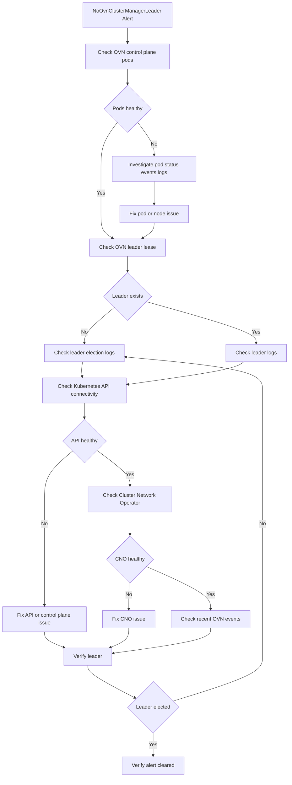

# NoOvnClusterManagerLeader

**Prometheus Source:** master-rules · **Severity:** Critical · **Duration Period :** For 5m · [Runbook](https://github.com/openshift/runbooks/blob/master/alerts/cluster-network-operator/NoOvnClusterManagerLeader.md)

---

## Meaning

The `NoOvnClusterManagerLeader` alert fires when the OVN-Kubernetes cluster manager has no elected leader for more than 5 minutes.
The OVN-Kubernetes cluster manager uses a Kubernetes Lease object for leader election.

---

## Impact

When the OVN-Kubernetes cluster manager cannot elect or maintain a leader, part of the networking control plane is degraded.

Potentially affected functionality includes:

- Node resource allocation
- EgressIP assignment/re-assignment and health checks
- EgressService node allocation/re-allocation
- DNS name resolution for EgressFirewall
- OVN secondary network IPAM

Note: Existing pod-to-pod networking may continue to work while the alert is firing. The primary impact is to OVN-Kubernetes control-plane functionality.

---

## Diagnosis

***1. Check OVN-Kubernetes control-plane pods***

```bash
oc get pods -n openshift-ovn-kubernetes -l app=ovnkube-control-plane -o wide
```

If any pod is not Running or Ready, investigate that pod first.


***2. Check the OVN-Kubernetes leader***

The OVN-Kubernetes cluster manager uses the ovn-kubernetes-master Lease for leader election.

```bash
oc get lease -n openshift-ovn-kubernetes ovn-kubernetes-master -o jsonpath='{.spec.holderIdentity}{"\n"}'
```

The returned pod is the current OVN-Kubernetes cluster-manager `leader`. If the command returns nothing, there is currently no leader.


***3. Check leader-election logs***

Check the ovnkube-cluster-manager container on all control-plane pods:

```bash
for pod in $(oc get pods -n openshift-ovn-kubernetes -l app=ovnkube-control-plane -o jsonpath='{.items[*].metadata.name}'); do
echo "===== $pod ====="
oc logs "$pod" -n openshift-ovn-kubernetes -c ovnkube-cluster-manager | grep -Ei "leader|elect|lease|error"
done

```

***4. Check Kubernetes API connectivity***

Leader election depends on the Kubernetes API. Test API connectivity from the ovnkube-cluster-manager container:

```bash
POD=$(oc get pods -n openshift-ovn-kubernetes -l app=ovnkube-control-plane -o jsonpath='{.items[0].metadata.name}')
oc exec -n openshift-ovn-kubernetes "$POD" -c ovnkube-cluster-manager -- sh -c 'curl -k -sS --connect-timeout 5 https://${KUBERNETES_SERVICE_HOST}:${KUBERNETES_SERVICE_PORT}/version'
```
Expected: Kubernetes API version information is returned.


***5. Check Cluster Network Operator***

```bash
oc get clusteroperator network
```

If the Network ClusterOperator is degraded, investigate and resolve the reported condition because it may be contributing to the OVN-Kubernetes control-plane problem.

***6. Check recent events***


```bash
oc get events -n openshift-ovn-kubernetes --sort-by='.lastTimestamp'
```

Look for:

- Pod failures
- Container restarts
- Readiness/liveness probe failures
- Scheduling failures
- Network errors
- Authentication/authorization errors
- Resource-related failures


---

## Mitigation


| What to look for | Check / Command | Action / Mitigation |
|---|---|---|
| **Control plane nodes are not running** | `oc get nodes -l node-role.kubernetes.io/control-plane` | If control-plane nodes are down/unavailable, follow the OpenShift procedure [disaster recovery / control-plane recovery](https://docs.redhat.com/en/documentation/openshift_container_platform/4.21/html/backup_and_restore/control-plane-backup-and-restore#disaster-recovery). Do not manually recreate OVN components until the control plane is healthy. |
| **Control plane nodes are Ready** | `oc get nodes -l node-role.kubernetes.io/control-plane` | Continue troubleshooting the Cluster Network Operator and OVN control-plane pods. |
| **Cluster Network Operator is reporting an error** | `oc get clusteroperator network` | Check `AVAILABLE`, `PROGRESSING`, and `DEGRADED` conditions. |
| **CNO is degraded** | `oc describe clusteroperator network` | Review the reported condition/message and correct the underlying network/operator issue. |
| **CNO logs show errors** | `oc logs -n openshift-network-operator deployment/cluster-network-operator` | Look for reconciliation failures, configuration errors, API connectivity problems, or failures managing OVN resources. Fix the reported issue and allow the operator to reconcile. Follow Doc [Cluster Network Operator](https://docs.redhat.com/en/documentation/openshift_container_platform/4.21/html/networking_operators/cluster-network-operator#nw-cluster-network-operator_cluster-network-operator) |
| **Check OVN control-plane pods** | `oc get pods -n openshift-ovn-kubernetes -l app=ovnkube-control-plane -o wide` | Identify whether one, several, or all `ovnkube-control-plane` pods are unavailable. |
| **One OVN control-plane pod is not running** | `oc get pods -n openshift-ovn-kubernetes -l app=ovnkube-control-plane -o wide` | Check the unhealthy pod's status, events, and logs. The remaining healthy OVN control-plane pods should normally perform leader election. |
| **One pod is CrashLoopBackOff / Error** | `oc describe pod -n openshift-ovn-kubernetes <pod>` | Check Events for image, volume, scheduling, probe, resource, or configuration failures. Correct the underlying issue and allow the Deployment to recreate/restart the pod. |
| **Check leader-election logs** | `oc logs -n openshift-ovn-kubernetes <pod> -c ovnkube-cluster-manager` | Look for leader-election errors, API-server connectivity failures, lease/update failures, or inability to acquire/renew the leader lease. |
| **API-server connectivity problem** | Check logs for `connection refused`, `timeout`, `i/o timeout`, or API errors | Verify API-server/control-plane health and network connectivity. Resolve the control-plane/API issue before troubleshooting OVN leader election further. |
| **All OVN control-plane pods are not running** | `oc get pods -n openshift-ovn-kubernetes -l app=ovnkube-control-plane -o wide` | Investigate why the pods cannot start. Check pod lifecycle state, scheduling, node availability, resources, volumes, probes, and events. Follow the [Pod Lifecycle](https://kubernetes.io/docs/concepts/workloads/pods/pod-lifecycle/) doc |
| **Pods are Pending** | `oc describe pod -n openshift-ovn-kubernetes <pod>` | Check Events for scheduling failures, insufficient resources, node constraints, taints/tolerations, or affinity problems. |
| **Pods are terminating/stuck** | `oc get pods -n openshift-ovn-kubernetes` | Investigate the node and pod lifecycle. Avoid force deletion unless you understand why the pod is stuck and normal recovery is not working. |
| **All OVN control-plane pods are Running** | `oc get pods -n openshift-ovn-kubernetes -l app=ovnkube-control-plane -o wide` | Continue with leader-election investigation. Check the `ovnkube-cluster-manager` container logs on **all** running control-plane pods. |
| **No leader despite all pods Running** | `oc logs -n openshift-ovn-kubernetes <pod> -c ovnkube-cluster-manager` | Compare logs from all control-plane pods. Identify lease acquisition/renewal failures or communication problems preventing a leader from being established. |
| **Check OVN leader-election lease** | `oc get lease -n openshift-ovn-kubernetes` | Verify that the expected OVN leader-election lease exists and is being updated. If the lease is stale, investigate why the cluster-manager cannot renew/acquire it rather than immediately deleting it. |
| **Leader pod appears unhealthy** | `oc describe pod -n openshift-ovn-kubernetes <pod>` | Resolve the pod's underlying failure. Once the old leader is unavailable, another healthy `ovnkube-cluster-manager` should acquire leadership. |
| **Network/operator issue resolved but alert remains** | `oc get clusteroperator network`<br>`oc get pods -n openshift-ovn-kubernetes` | Allow time for reconciliation and Prometheus evaluation. Verify that a leader is present and the alert condition has cleared. |


---


## Decision Flow


