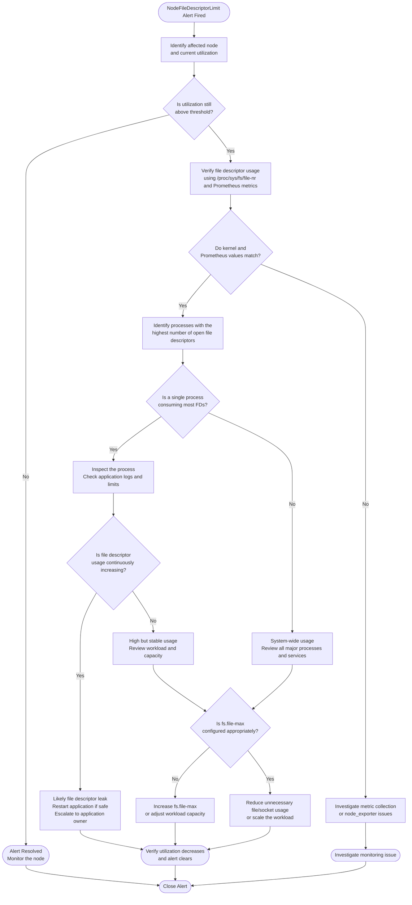

# NodeFileDescriptorLimit

**Prometheus Source:** `node-exporter-rules` · **Severity:** `Warning/Critical` · **Duration Period :** `15m` · [Runbook](https://github.com/openshift/runbooks/blob/master/alerts/cluster-monitoring-operator/NodeFileDescriptorLimit.md)

## Meaning

The NodeFileDescriptorLimit alert indicates that a node is approaching the maximum number of system-wide file descriptors that the Linux kernel can allocate. File descriptors are kernel-managed handles used by processes to access files, network sockets, pipes, devices, and other input/output (I/O) resources.

Every time an application opens a file, accepts a network connection, creates a socket, or accesses another I/O resource, the kernel allocates a file descriptor. These descriptors remain in use until the application closes the resource or the process exits.

The alert is based on the percentage of allocated file descriptors `(node_filefd_allocated)` relative to the maximum number of file descriptors allowed by the kernel `(node_filefd_maximum)`.

***Alert Expression:***

```bash
(node_filefd_allocated{job="node-exporter"} * 100 / node_filefd_maximum{job="node-exporter"} > 70)
```

Two severity levels are defined:

`Warning`: Triggered when more than 70% of the available file descriptors are allocated and the condition persists for 15 minutes.
`Critical`: Triggered when more than 90% of the available file descriptors are allocated and the condition persists for 15 minutes.

## Impact

When the node approaches the system-wide file descriptor limit:

- Applications may fail to open files or sockets.
- New network connections may be rejected.
- SSH access to the node may fail.
- kubelet, CRI-O, or other system services may become unstable.
- Pods may fail to start or communicate.

If the limit is completely exhausted, the node can become unavailable.

---

## Diagnosis

### Variables (from Alert)

```bash
Node=<labels.instance>
Current_Utilization=<value>%
Severity=<labels.severity>
Job=<labels.job>
```

***Step 1: Identify the affected node***

Determine which node triggered the alert.

```promql
(node_filefd_allocated * 100 / node_filefd_maximum)
```

or

```promql
ALERTS{alertname="NodeFileDescriptorLimit"}
```

***Step 2: Check current utilization***

On the affected node:

```bash
cat /proc/sys/fs/file-nr
```

Where:

| Field | Description |
|--------|-------------|
| First | Allocated file descriptors |
| Second | Unused allocated descriptors |
| Third | Maximum system-wide file descriptors |

Calculate utilization:

```
Allocated / Maximum × 100
```

Example:

```
42560 / 60000 × 100 = 70.93%
```

***Step 3: Identify which process is consuming file descriptors***

List processes with the highest number of open file descriptors.

```bash
for pid in /proc/[0-9]*; do
    echo "$(ls $pid/fd 2>/dev/null | wc -l) $(basename $pid)"
done | sort -nr | head
```

or

```bash
lsof | awk '{print $2}' | sort | uniq -c | sort -nr | head
```

Identify the corresponding process:

```bash
ps -fp <PID>
```

***Step 4: Check per-process limits***

```bash
cat /proc/<PID>/limits
```

or

```bash
ulimit -n
```

This helps determine whether the issue is caused by:

- excessive file usage,
- a file descriptor leak,
- or a configured limit.

***Step 5: Determine whether the usage is increasing***

Check the values several times.

```bash
watch -n5 cat /proc/sys/fs/file-nr
```

If the allocated count continuously increases without dropping, a process may be leaking file descriptors.

***Step 6: Check recent node events***

```bash
journalctl -xe
```

or

```bash
dmesg | tail
```

Look for messages such as:

```
Too many open files/ limit reached / EMFILE
```

---

## Mitigation

Depending on the root cause:

- Restart the leaking application (if appropriate).
- Fix the application causing the leak.
- Reduce unnecessary file/socket usage.
- Increase `fs.file-max` if the configured value is insufficient.
- Tune application `ulimit` values if required.

---

## Decision-Flow



