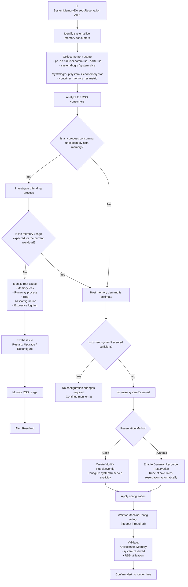

SystemMemoryExceedsReservation

Runbook · Tier 0 · warning · System memory usage ≥ 95% of reserved memory

Meaning

The node's system processes (such as kubelet, CRI-O, systemd, NetworkManager, sshd, etc.) are consuming more than 95% of the reserved system memory.

This does not necessarily mean the node is out of memory. It indicates that the reserved memory for critical node services is nearly exhausted, increasing the risk that these services may compete with application pods for memory.

Impact
Increased risk of node instability.
Critical system services (kubelet, CRI-O) may become memory constrained.
Increased probability of Out-Of-Memory (OOM) events affecting node services.
Node may eventually become NotReady.
Scheduler may overestimate available resources if reservation is too small for the workload.


Diagnosis
## Variables (from alert)

```bash
NODE=<labels.node>
```

| Diagnosis | What to look for | Cause | Action |
|------------|------------------|--------|--------|
| `oc debug node/$NODE -- cat /host/etc/kubernetes/kubelet.conf \| grep -A5 systemReserved` | Memory reservation too small (for example, `1Gi` on a busy node) | `LOW_RESERVATION` | Review `systemReserved.memory` and increase the reservation if required. |
| `oc get --raw /api/v1/nodes/$NODE/proxy/stats/summary` | Kubelet or CRI-O memory usage is close to the reserved memory | `EXPECTED_SYSTEM_USAGE` | Increase the reservation if the workload and system usage are expected. |
| `oc adm top node $NODE` | Node memory utilization > 90% | `NODE_MEMORY_PRESSURE` | Investigate overall node memory usage and identify memory-intensive workloads. |
| `oc describe node $NODE` | `MemoryPressure=True` | `NODE_MEMORY_PRESSURE` | Platform SRE investigation. |
| `oc get pods -A --field-selector spec.nodeName=$NODE --no-headers \| wc -l` | Very high pod count | `HIGH_POD_DENSITY` | Increase `systemReserved.memory` or reduce pod density on the node. |
| `oc get events --field-selector involvedObject.kind=Node,involvedObject.name=$NODE --sort-by='.lastTimestamp' \| tail -20` | `OOMKilled`, `Eviction`, or other node resource events | `NODE_RESOURCE_PRESSURE` | Platform SRE investigation. |
| `oc get --raw /api/v1/nodes/$NODE/proxy/stats/summary` | Kubelet memory usage is unusually high compared to the normal baseline | `KUBELET_HIGH_USAGE` | Investigate kubelet activity (pod churn, image pulls, excessive pod count, etc.). |
| `oc get --raw /api/v1/nodes/$NODE/proxy/stats/summary` | CRI-O (runtime) memory usage is unusually high | `CRIO_HIGH_USAGE` | Investigate container runtime activity and image management. |
| — | No obvious issue found | `UNKNOWN` | Escalate to Platform SRE for further investigation. |

Look for

systemReserved:
  cpu: 500m
  memory: 1Gi
Check actual system memory usage
oc get --raw /api/v1/nodes/$NODE/proxy/stats/summary

Review

kubelet
runtime (CRI-O)
other system containers
Check node conditions
oc describe node $NODE

Look for

MemoryPressure=True
Check pod density
oc get pods -A --field-selector spec.nodeName=$NODE --no-headers | wc -l
Check node utilization
oc adm top node $NODE
Check recent node events
oc get events \
--field-selector involvedObject.kind=Node,involvedObject.name=$NODE \
--sort-by='.lastTimestamp'
Mitigation
LOW_RESERVATION

If the node is consistently using more than 95% of the reserved memory:

Increase systemReserved.memory using a KubeletConfig.
Follow the Red Hat sizing guidance or enable automatic reservation (OCP 4.8+).
HIGH_POD_DENSITY

If the node hosts a very large number of pods:

Reduce pod density (if possible), or
Increase systemReserved.memory.
NODE_MEMORY_PRESSURE

If the node itself is under memory pressure:

Investigate workloads consuming excessive memory.
Review recent deployments.
Check for memory leaks.
Consider redistributing workloads.
EXPECTED_SYSTEM_USAGE

If kubelet/CRI-O legitimately require more memory (large clusters, frequent pod churn, heavy image pulls):

Increase the reservation.
Monitor after the change.
UNKNOWN

Escalate to Platform SRE for further investigation.

Cause → Notify
Cause	Notify
LOW_RESERVATION	Platform SRE
HIGH_POD_DENSITY	Platform SRE
NODE_MEMORY_PRESSURE	Platform SRE
KUBELET_HIGH_USAGE	Platform SRE
CRIO_HIGH_USAGE	Platform SRE
EXPECTED_SYSTEM_USAGE	Platform SRE
NODE_RESOURCE_PRESSURE	Platform SRE
UNKNOWN	Platform SRE

Notes
This alert is an early warning, not necessarily an outage.
It monitors system.slice memory usage (system processes), not pod memory usage.
Increasing systemReserved.memory does not add more RAM to the node; it reserves a larger portion of existing memory for critical node services, reducing the memory available for scheduling application pods. This helps prevent kubelet and other system services from being starved under heavy load.

Set Manually:

apiVersion: machineconfiguration.openshift.io/v1
kind: KubeletConfig
metadata:
  name: set-allocatable
spec:
  autoSizingReserved: false
  machineConfigPoolSelector:
    matchLabels:
      pools.operator.machineconfiguration.openshift.io/worker: ""
  kubeletConfig:
    systemReserved:
      cpu: 1000m
      memory: 4Gi
      ephemeral-storage: 50Mi
#...

Automatic allocation:

If you updated your cluster from a version earlier than 4.21, automatic allocation of system resources is disabled by default. To enable the feature, delete the 50-worker-auto-sizing-disabled machine config.


-------

See what processes consuming RSS (anon)


How to identify how much memory left on each node: (RSS)

oc exec -n openshift-monitoring prometheus-k8s-0 -c prometheus -- \
  curl -s http://localhost:9090/api/v1/query --data-urlencode \
  'query=(sum(kube_node_status_capacity{resource="memory"} - kube_node_status_allocatable{resource="memory"}) by (node) * 0.95) - sum(container_memory_rss{id="/system.slice"}) by (node)' | jq '.data.result[] | {node: .metric.node, megabytes_left_before_alert: ((.value[1] | tonumber) / 1024 / 1024)}'

How to identify how much memory consumed by processes in RSS.:

ps -eo pid,user,rss,cmd --sort=-rss | grep -E "PID|crio|kubelet|systemd|NetworkManager|python" | head -n 15 | awk '
NR==1 {print $1, $2, "RSS_MEMORY", $4; next} 
{
  rss=$3; 
  if(rss > 1024*1024) {
    printf "%-6s %-8s %-10.2f GB %s\n", $1, $2, rss/(1024*1024), $4
  } else {
    printf "%-6s %-8s %-10.2f MB %s\n", $1, $2, rss/1024, $4
  }
}'


------
runbook - https://github.com/openshift/runbooks/blob/master/alerts/machine-config-operator/SystemMemoryExceedsReservation.md


----

mermaid code:




-------------------

Step 1: Determine the current systemReserved memory

The alert compares the memory used by system processes against the memory reserved by the kubelet.

First, determine how much memory is reserved on the node.

Check node capacity and allocatable memory
oc get node <node-name> -o jsonpath='{.status.capacity.memory}{"\n"}{.status.allocatable.memory}{"\n"}'

Calculate:

System Reserved Memory = Capacity - Allocatable

For example:

Capacity	Allocatable	System Reserved
8 GiB	7 GiB	1 GiB
Step 2: Identify what is consuming the reserved memory

The alert monitors system.slice, so begin by identifying the host processes consuming memory.

View top RSS consumers
ps -eo pid,user,comm,rss --sort=-rss
Identify services running in system.slice
systemd-cgls /system.slice
View memory usage of system.slice
cat /sys/fs/cgroup/system.slice/memory.current
View memory breakdown
cat /sys/fs/cgroup/system.slice/memory.stat

Useful fields include:

anon
file
slab
kernel_stack
pagetables
Step 3: Identify the high memory consumer and investigate

Determine which process is consuming the majority of the reserved memory.

Process	Typical Reason	Investigation
kubelet	Large number of Pods, many volumes, frequent Pod lifecycle events	Check Pod density, kubelet logs, kubelet configuration, excessive Pod churn
CRI-O	Large number of running containers/images	Check running containers, image garbage collection, container lifecycle
OVN-Kubernetes	Heavy networking load, many Services/Pods	Check OVN logs, networking scale, OVN database health
metrics-server	Large clusters or heavy metrics collection	Verify expected cluster size and metrics load
systemd-journald	Excessive logging	Review journal size and log volume
Node Exporter	Usually low memory	Normally no action required
NetworkManager	Network issues or configuration changes	Review NetworkManager logs
Python/Custom Process	Test process, memory leak, custom application	Investigate the application or terminate if unnecessary

Also evaluate Kubernetes workload memory:

oc adm top node

oc adm top pods -A

oc adm top pods -A --containers

High workload density often increases memory usage of kubelet, CRI-O, and networking components.

Step 4: Determine whether the memory usage is expected

Ask the following:

Is the node running significantly more Pods than usual?
Is the workload memory-intensive?
Is the increase temporary or sustained?
Is there evidence of a memory leak or abnormal process behavior?
If memory usage is not expected

Investigate and resolve the offending process:

Memory leak
Excessive logging
Misconfiguration
Runaway process
Software bug

Continue monitoring after remediation.

If memory usage is expected

The node legitimately requires more host memory.

Proceed with increasing systemReserved.

Step 5: Resize systemReserved


--------------

There are two supported approaches.

Option 1 — Static Reservation (Manual)

Create or modify a KubeletConfig and explicitly define:

systemReserved:
  cpu: ...
  memory: ...

Use this when you want a fixed reservation for a machine pool.

Recommended when:

Node sizes are consistent.
Reservation requirements are well understood.
You want complete control over the reserved resources.
Option 2 — Dynamic Resource Reservation

Enable Dynamic Resource Reservation.

The kubelet automatically calculates the reservation based on:

Total node memory
Total node CPU

Larger nodes receive proportionally larger reservations.

Recommended when:

Nodes have different sizes.
Large clusters are expected to grow.
You want reservations to scale automatically with hardware capacity.


-------------

https://github.com/AliAkkaya7/alert-eda/blob/main/alert-runbooks/NodeMemoryMajorPagesFaults.md
oc debug node/$NODE -- chroot /host bash -c 'grep "^SYSTEM_RESERVED_MEMORY=" /etc/node-sizing.env'
RUNBOOK - https://github.com/openshift/runbooks/blob/master/alerts/machine-config-operator/SystemMemoryExceedsReservation.md

Confirm the availablity of Machine config:
 oc get mc | grep 50                        
50-master-auto-sizing-disabled                                                                
50-worker-auto-sizing-disabled

Then delete MC for master and worker.
oc delete mc 50-master-auto-sizing-disabled  
oc delete mc 50-worker-auto-sizing-disabled
