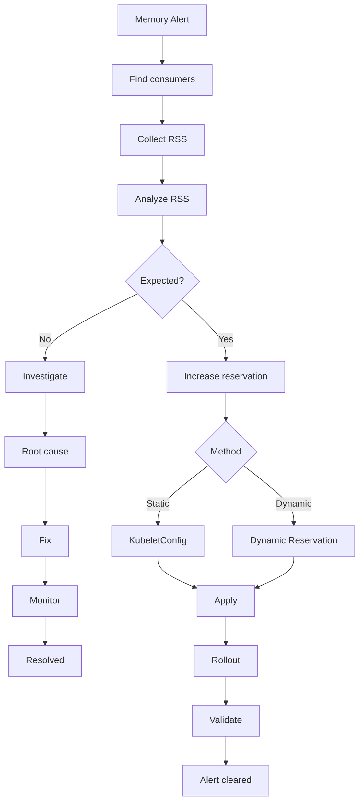

# SystemMemoryExceedsReservation

PrometheusRule Source: `machine-config-daemon` · Alert Severity: `warning` · Pending Period: `15m` · [Runbook](https://github.com/openshift/runbooks/blob/master/alerts/machine-config-operator/SystemMemoryExceedsReservation.md)

---

## Meaning

The node's system processes (such as kubelet, CRI-O, systemd, NetworkManager, sshd, etc.) are consuming more than 95% of the reserved system memory.<br>
This does not necessarily mean the node is out of memory. It indicates that the reserved memory for critical node services is nearly exhausted, increasing the risk that these services may compete with application pods for memory.

---

## Impact

- Increased risk of node instability.
- Critical system services (kubelet, CRI-O) may become memory constrained.
- Increased probability of Out-Of-Memory (OOM) events affecting node services.
- Node may eventually become NotReady.
- Scheduler may overestimate available resources if reservation is too small for the workload.

---

## Diagnosis
### Variables (from alert)

***Step 1: Determine the current systemReserved memory***

```bash
oc debug node/<NODE> --chroot /host bash -c 'grep "^SYSTEM_RESERVED_MEMORY=" /etc/node-sizing.env'
```

***Step 2: Identify what is consuming the reserved memory***

```bash
oc debug node/$NODE 
chroot /host
```
Check memory status for all major processes:

```bash
ps -eo pid,user,rss,cmd --sort=-rss | grep -E "PID|crio|kubelet|systemd|NetworkManager|python" | head -n 15 | awk '
NR==1 {print $1, $2, "RSS_MEMORY", $4; next} 
{
  rss=$3; 
  if(rss > 1024*1024) {
    printf "%-6s %-8s %-10.2f GB %s\n", $1, $2, rss/(1024*1024), $4
  } else {
    printf "%-6s %-8s %-10.2f MB %s\n", $1, $2, rss/1024, $4
  }
}'
```
***Step 3: Compare on each node level how much memory left under Resident Set Size***

```bash
oc exec -n openshift-monitoring prometheus-k8s-0 -c prometheus -- \
  curl -s http://localhost:9090/api/v1/query --data-urlencode \
  'query=(sum(kube_node_status_capacity{resource="memory"} - kube_node_status_allocatable{resource="memory"}) by (node) * 0.95) - sum(container_memory_rss{id="/system.slice"}) by (node)' | jq '.data.result[] | {node: .metric.node, megabytes_left_before_alert: ((.value[1] | tonumber) / 1024 / 1024)}'
```

This displays the remaining system memory available on each node before the alert threshold is reached.

***Step 4: Determine whether the memory usage is expected***

Areas the investigate:

- Is the node running significantly more Pods than usual?<br>
- Is the workload memory-intensive?<br>
- Is the increase temporary or sustained?<br>
- Is there evidence of a memory leak or abnormal process behavior?<br>
- If memory usage is not expected, Investigate and resolve the offending process.

If memory usage is expected, the node legitimately requires more host memory. Proceed with increasing systemReserved, Follow `Mitigation` Section for more information.

---

# Mitigation:

**Note:**<br>The mitigation requires a MachineConfig/KubeletConfig update which triggers a reboot on the nodes. Schedule the change during a maintenance window, as it may result in temporary service disruption or downtime.

By default, OpenShift reserves 1GB of memory for system components on each node. If this reservation is insufficient for workload,update it by creating or updating a kubelet custom resource. To manually set resource values, you must use a kubelet configuration as mentioned below in sample configuration for worker nodes:

### Manual Allocation:

apiVersion: machineconfiguration.openshift.io/v1
kind: KubeletConfig
metadata:
  name: set-allocatable
spec:
  machineConfigPoolSelector:
    matchLabels:
      pools.operator.machineconfiguration.openshift.io/worker: ""
  kubeletConfig:
    systemReserved:
      cpu: 1000m
      memory: 3Gi
#...

Similary, for master nodes the `matchlabels` entry would be change to `pools.operator.machineconfiguration.openshift.io/master: ""`

### Automatic allocation:

Starting with Openshift 4.21, the automatic reservation is configured by default for newly installed clusters. If you updated your cluster from a version earlier than 4.21, automatic allocation of system resources is disabled by default. To enable this feature, delete the "50-worker-auto-sizing-disabled" machine config.

- Confirm the availability of Machine Config:
```bash
oc get mc | grep 50
```
- Delete Machine Config for master and worker:
```bash
oc delete mc 50-master-auto-sizing-disabled
oc delete mc 50-worker-auto-sizing-disabled
```

For more information, refer [OpenShift Doc](https://docs.redhat.com/en/documentation/openshift_container_platform/4.21/html/nodes/working-with-nodes#nodes-nodes-resources-configuring).

---

## Decision Flow


```mermaid

flowchart TD

A["Memory Alert"]

A --> B["Find consumers"]

B --> C["Collect RSS"]

C --> D["Analyze RSS"]

D --> E{"Expected?"}

E -->|No| F["Investigate"]

F --> G["Root cause"]

G --> H["Fix"]

H --> I["Monitor"]

I --> J["Resolved"]

E -->|Yes| K["Increase reservation"]

K --> L{"Method"}

L -->|Static| M["KubeletConfig"]

L -->|Dynamic| N["Dynamic Reservation"]

M --> O["Apply"]

N --> O

O --> P["Rollout"]

P --> Q["Validate"]

Q --> R["Alert cleared"]
```
