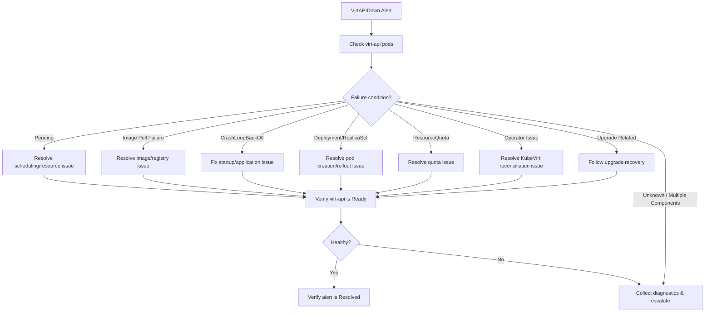

# VirtAPIDown

PrometheusRule Source: `prometheus-kubevirt-rules` · Alert Severity: `Critical` · Pending Period : `10m` · [Runbook](https://github.com/openshift/runbooks/blob/master/alerts/openshift-virtualization-operator/VirtAPIDown.md)

---

## Meaning:

This alert is triggered when no running virt-api pod is detected for 10 minutes.

The virt-api component is a critical part of OpenShift Virtualization. It provides the API service used by other OpenShift Virtualization components to interact with KubeVirt resources.

If all virt-api pods are unavailable or unable to serve requests, OpenShift Virtualization API operations may fail.

***Expression:***

```bash
kubevirt_virt_api_up == 0
```

---

## Impact:

When virt-api is unavailable:

- OpenShift Virtualization API requests may fail or become unavailable.
- KubeVirt/OpenShift Virtualization resources may not be accessible through their API.
- Operations involving VirtualMachines (VMs), VirtualMachineInstances (VMIs), and related virtualization resources may fail.
- Automation and controllers that depend on the KubeVirt API may be unable to perform their operations.
- Existing running VMs may continue running; however, management operations can be affected depending on the nature and duration of the virt-api outage.

---

## Diagnosis:

1. Set the NAMESPACE environment variable:

```bash
export NAMESPACE="$(oc get kubevirt -A -o custom-columns="":.metadata.namespace)"
```
2. Check the status of the virt-api pods:

```bash
oc -n $NAMESPACE get pods -l kubevirt.io=virt-api
```

3. Check the status of the virt-api deployment:

```bash
oc -n $NAMESPACE get deploy virt-api -o yaml
```

4. Check the virt-api deployment details for issues such as crashing pods or image pull failures:

```bash
oc -n $NAMESPACE describe deploy virt-api
```
5. Check for issues such as nodes in a NotReady state:

```bash
oc get nodes
```

---

## Mitigation:


The mitigation action depends on the failure condition identified during diagnosis. Follow the applicable action plan below.

| Scenario | What to look for | Action / Mitigation |
|---|---|---|
| **no `virt-api` pod is Running and Ready** | Run `oc -n $NAMESPACE get pods -l kubevirt.io=virt-api -o wide`. Check whether pods are `Pending`, `CrashLoopBackOff`, `ImagePullBackOff`, `Error`, or whether no pods exist. | Identify the specific failure condition and follow the applicable mitigation action below. Do not blindly restart the `virt-api` Deployment. |
| **`virt-api` pods are `Pending`** | Run `oc -n $NAMESPACE describe pod <virt-api-pod>`. Look for `Insufficient cpu`, `Insufficient memory`, taints, affinity/anti-affinity, node selector, ResourceQuota, or scheduler errors. | Resolve the identified scheduling or resource constraint. Once resolved, allow the Deployment to schedule the `virt-api` pod(s). |
| **`virt-api` pods are in `ImagePullBackOff` or `ErrImagePull`** | Run `oc -n $NAMESPACE describe pod <virt-api-pod>`. Look for registry connection errors, authentication failures, missing image, TLS/certificate errors, DNS errors, or timeouts. | Resolve the underlying image or registry issue. Restore registry connectivity, authentication, DNS, TLS, or image availability as applicable. Do not replace the `virt-api` image with an arbitrary image. |
| **`virt-api` pods are in `CrashLoopBackOff`** | Run `oc -n $NAMESPACE logs <virt-api-pod>` and `oc -n $NAMESPACE logs <virt-api-pod> --previous`. Run `oc -n $NAMESPACE describe pod <virt-api-pod>`. Look for startup errors, configuration errors, certificate/secret issues, dependency failures, or resource-related failures. | Identify and correct the underlying startup failure. Once corrected, allow the Deployment to recreate/restart the container and verify that it remains `Running` and `Ready`. |
| **`virt-api` Deployment has zero replicas** | Run `oc -n $NAMESPACE get deploy virt-api`. Check `.spec.replicas` and determine whether the scale-down was intentional. | If unintentionally scaled down, restore the expected replica configuration through the supported/operator-managed configuration. Investigate why the replica count was changed. |
| **`virt-api` ReplicaSet cannot create pods** | Run `oc -n $NAMESPACE get rs -l kubevirt.io=virt-api` and `oc -n $NAMESPACE describe rs <virt-api-rs>`. Look for admission, quota, resource, or scheduling errors. | Resolve the reported admission, resource, or scheduling problem and verify that the ReplicaSet creates the required `virt-api` pods. |
| **ResourceQuota prevents `virt-api` pod creation** | Run `oc -n $NAMESPACE get resourcequota` and `oc -n $NAMESPACE describe resourcequota`. Look for exceeded CPU, memory, or object limits. | Resolve the ResourceQuota issue according to the approved resource-management procedure. Verify that the `virt-api` pod can subsequently be created. |
| **KubeVirt operator is unhealthy** | Run `oc -n $NAMESPACE get kubevirt`, `oc -n $NAMESPACE get pods`, and `oc -n $NAMESPACE logs deploy/virt-operator`. Look for degraded/unavailable conditions or reconciliation errors. | Resolve the underlying operator issue and allow the operator to reconcile the `virt-api` Deployment. Avoid manually modifying operator-managed resources unless required by a supported recovery procedure. |
| **`virt-api` failure started during an OpenShift Virtualization/KubeVirt upgrade** | Run `oc get clusterversion`, `oc get mcp`, `oc -n $NAMESPACE get kubevirt`, and `oc get events -A --sort-by='.lastTimestamp' \| tail -100`. Look for image-pull, operator reconciliation, rollout, or upgrade errors. | Follow the approved upgrade recovery procedure. Resolve the specific image, operator, or rollout issue rather than manually replacing operator-managed resources. |
| **IF multiple KubeVirt control-plane components are unavailable** | Check the status of `virt-api`, `virt-controller`, `virt-operator`, and the KubeVirt resource. Review recent events and operator logs. | Treat this as a broader OpenShift Virtualization control-plane incident. Collect diagnostics and escalate if the issue cannot be recovered using the applicable procedure. |
| **IF none of the above conditions explain why `virt-api` is unavailable** | Collect `virt-api` pod logs, previous logs, pod/Deployment/ReplicaSet descriptions, events, KubeVirt status, and operator logs. | Do not perform arbitrary changes. Escalate the incident with the collected diagnostics and incident timeline. |

---

## Decision Flow



