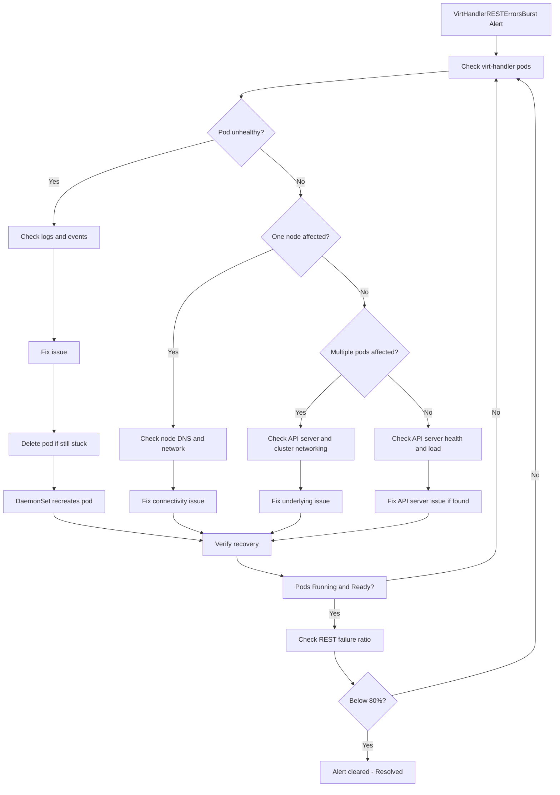

# VirtHandlerRESTErrorsBurst

PrometheusRuleSource: `prometheus-kubevirt-rules` · Alert Severity: `Critical` ·  Pending Period:`5m` · [Runbook](https://github.com/openshift/runbooks/blob/master/alerts/openshift-virtualization-operator/VirtHandlerRESTErrorsBurst.md)

---
  
## Meaning:

VirtHandler is experiencing a high rate of failed REST API requests (HTTP 4xx/5xx). The alert fires when 80% or more of REST requests fail continuously for 5 minutes, indicating a potential communication or API availability issue.

This can occur when virt-handler pods are unable to successfully communicate with the Kubernetes API server. Common causes include:

- API server overload or latency, resulting in failed or timed-out requests.
- Connectivity issues between virt-handler and the API server, such as DNS or network problems on the node.

***Expression:***

```bash
sum(rate(kubevirt_rest_client_requests_total{code=~"(4|5)[0-9][0-9]",namespace="openshift-cnv",pod=~"virt-handler-.*"}[5m]))
/
sum(rate(kubevirt_rest_client_requests_total{namespace="openshift-cnv",pod=~"virt-handler-.*"}[5m]))
>= 0.8
```

This expression means that at least 80% of REST requests made by virt-handler are returning HTTP 4xx/5xx errors over the evaluation period.

---

## Impact

- Running workloads on the affected node are not impacted and should continue to run normally.
- VM status updates may not be propagated to the Kubernetes API server, resulting in stale or outdated status information.
- VM management operations may fail, including live migrations and other lifecycle actions that depend on API server communication.
- New management actions for VMs on the affected node may be delayed or unsuccessful while the issue persists.
- The impact is primarily on VM management, orchestration, and status reporting, rather than the execution of already-running workloads.

___

## Diagnosis

***1. Set the `NAMESPACE` environment variable***

```bash
   export NAMESPACE="$(oc get kubevirt -A -o jsonpath='{.items[0].metadata.namespace}')"
```

***2. Check the status of all virt-handler pods***

```bash
oc get pods -n "$NAMESPACE" -l kubevirt.io=virt-handler -o wide
```

Check whether the affected virt-handler pods are Running and Ready, and note the nodes on which they are running.
Determine whether the issue is isolated to one node or affects multiple virt-handler pods.
If only one node's virt-handler is reporting failures, focus the investigation on that node's DNS and network connectivity. If multiple virt-handler pods are affected, investigate the API server or cluster-wide networking.

***3. Check virt-handler logs for API communication errors***

```bash
oc logs -n "$NAMESPACE" <virt-handler-pod> --since=10m | \
  grep -Ei 'error|failed|forbidden|timeout|connection refused|unable|api'
```

Look for HTTP 4xx/5xx responses, timeouts, connection failures, or other API-server communication errors.

***4. Check API-server health***

```bash
oc get clusteroperator kube-apiserver
oc get pods -n openshift-kube-apiserver
```

If the API server is degraded or its pods are unhealthy, investigate API-server resource usage, request rate, and response latency.

***5. Check recent events for the affected pod and node***

```bash
oc describe pod -n "$NAMESPACE" <virt-handler-pod>
```
And:

```bash
oc describe node <node-name>
```

Look for network, DNS, resource, restart, or connectivity-related events.

***6. Monitor the REST API failure ratio***

```bash
oc exec -n openshift-monitoring prometheus-k8s-0 -c prometheus -- \
  curl -s -G 'http://localhost:9090/api/v1/query' \
  --data-urlencode 'query=sum(rate(kubevirt_rest_client_requests_total{code=~"(4|5)[0-9][0-9]",namespace="openshift-cnv",pod=~"virt-handler-.*"}[5m])) / sum(rate(kubevirt_rest_client_requests_total{namespace="openshift-cnv",pod=~"virt-handler-.*"}[5m]))' \
  | jq '.data.result[0].value[1]'
```
---

## Mitigation


***1. If virt-handler pod is unhealthy or stuck***

Review its logs and pod events to identify the underlying problem.If the pod remains unhealthy after resolving the underlying issue, allow the operator to recreate the pod or restart the affected virt-handler pod:

```bash
oc delete pod -n "$NAMESPACE" <virt-handler-pod>
```

***2. If the API server is unhealthy or overloaded***

Check the kube-apiserver pods, resource utilization, request rate, and latency. 
Identify and address the API-server resource or request-load issue.
Wait for API-server health and virt-handler REST request success rates to return to normal.

***3. If the issue is isolated to a specific node***

Check the node's DNS and network connectivity to the Kubernetes API server.
Resolve any DNS, routing, firewall, or network connectivity issues identified on the node.
Verify that the affected virt-handler can successfully communicate with then API server.
The DaemonSet should recreate the pod automatically.

***4. If multiple virt-handler pods are affected****

Investigate cluster-wide API-server or networking problems rather than restarting individual virt-handler pods.
Resolve the underlying cluster-wide issue and monitor the REST API failure ratio.

***5. Verify recovery***

```bash
oc get pods -n "$NAMESPACE" -l kubevirt.io=virt-handler -o wide
```

Confirm that the affected virt-handler pods are Running and Ready, and verify that the REST API failure ratio has dropped below 80% and the alert has cleared.


---

## Decision flow




