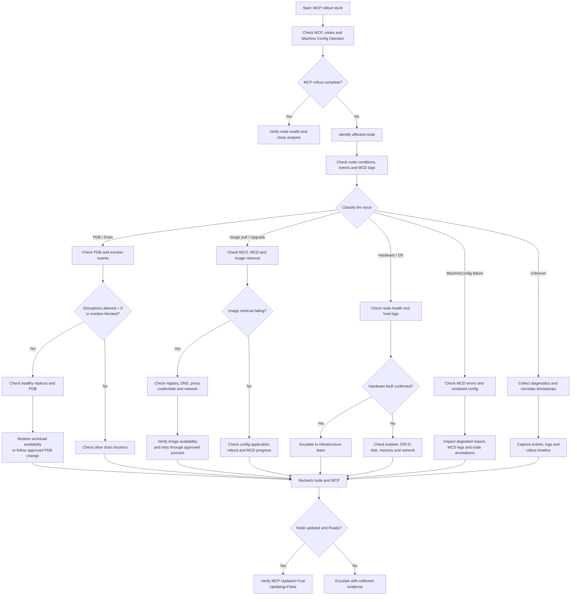

```mermaid
flowchart TD
    A["Start: MCP rollout stuck"] --> B["Check MCP, nodes and Machine Config Operator"]
    B --> C{"MCP rollout complete?"}
    
    C -->|Yes| D["Verify node health and close analysis"]
    C -->|No| E["Identify affected node"]
    E --> F["Check node conditions, events and MCD logs"]
    F --> G{"Classify the issue"}

    G -->|PDB / Drain| H["Check PDB and eviction events"]
    G -->|Image pull / Upgrade| I["Check MCO, MCD and image retrieval"]
    G -->|Hardware / OS| J["Check node health and host logs"]
    G -->|MachineConfig failure| K["Check MCD errors and rendered config"]
    G -->|Unknown| L["Collect diagnostics and correlate timestamps"]

    H --> M{"Disruptions allowed = 0<br/>or eviction blocked?"}
    M -->|Yes| N["Check healthy replicas and PDB"]
    N --> O["Restore workload availability<br/>or follow approved PDB change"]
    M -->|No| P["Check other drain blockers"]

    I --> Q{"Image retrieval failing?"}
    Q -->|Yes| R["Check registry, DNS, proxy,<br/>credentials and network"]
    R --> S["Verify image availability<br/>and retry through approved process"]
    Q -->|No| T["Check config application,<br/>reboot and MCD progress"]

    J --> U{"Hardware fault confirmed?"}
    U -->|Yes| V["Escalate to infrastructure team"]
    U -->|No| W["Check kubelet, CRI-O,<br/>disk, memory and network"]

    K --> X["Inspect degraded reason,<br/>MCD logs and node annotations"]
    L --> Y["Capture events, logs and<br/>rollout timeline"]

    O --> Z["Recheck node and MCP"]
    P --> Z
    S --> Z
    T --> Z
    V --> Z
    W --> Z
    X --> Z
    Y --> Z

    Z --> AA{"Node updated and Ready?"}
    AA -->|Yes| AB["Verify MCP Updated=True<br/>Updating=False"]
    AA -->|No| AC["Escalate with collected evidence"]
```
